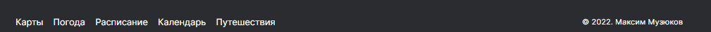

# Russian-travel

## Проект №2 от платформы "Яндекс Практикум"

---

---

Проект представлеяет собой одностраничный сайт с гиперссылками (всем гиперссылкам дано свойства прозрачности при наведении), который адаптированный под разные устройства и разрешения. Содержание данной страницы повествует об "Путешествиях по России", представлен определенный маршрут, статистические данные, краткое описание мест путешествия. Данный проект представляет собой страницу,которая разбита на три блока : вводный контент - header, основной контент - content, "подвал" сайта - footer. Элементы данного сайта построены при помощи Flex и Grid.

Блок Header представляет собой элементы : изображение логотипа img и блок с гиперссылками а, которые расположены при помощи flex-box верстки.

Блок Content включает в себя пять секций с основной информацией по данной теме : Первый блок Lead показывает маршрут путешествия. Lead включает в себя следующий перечень элементов: заголовок h1, два параграфа p и картинку img. Расположение элементов выполнены при помощи flex-box верстки.

Второй блок Intro рассказывает о статистике путешествий. Intro включает в себя заголовок h2, параграф p и списка ul статистических данных. Расположение элементов выполнены при помощи flex-box верстки.

Третий блок Photo-grid содержит фотографии по маршруту путешествий. Photo-grid включает в себя некоторое количество картинок img, которые расположены при помощи grid верстки.

Четвертый блок Places содержит пять отдельных коробок place,в которых кратко рассказывается о местах путешествия. Place содержит заголовок h2, картинку img, блок с гиперссылкой a и небольшой коробкой span с текстом внутри,а также два параграфа p. В Places расположение пяти коробок Place осуществляется при помощи flex-box верстки,а вот уже в самих Place расположение элементов идет через grid верстку.

Пятый блок Cover содержит фоновую картинку и название учебной темы о Транссибе. Блок состоит из гиперссылки,в которую вложена коробка с заголовком h2 и параграфов p. Элементы расположены при помощи flex-box верстки и контекста наложения.

Блок "подвала" содержит навигационную коробку с дополнительными "примочками" от компании Яндекс и подписью исполнителя данного сайта с указанием года выполнения работы.

---

В данном проекте соблюдается семантика, использована технология построение сетки flex и grid, присутствует пример осуществления контекста наложения,у ссылок присутствует наведение с эффектом прозрачности и затемнения.

Ссылка на проект https://mazini65.github.io/russian-travel/ .
